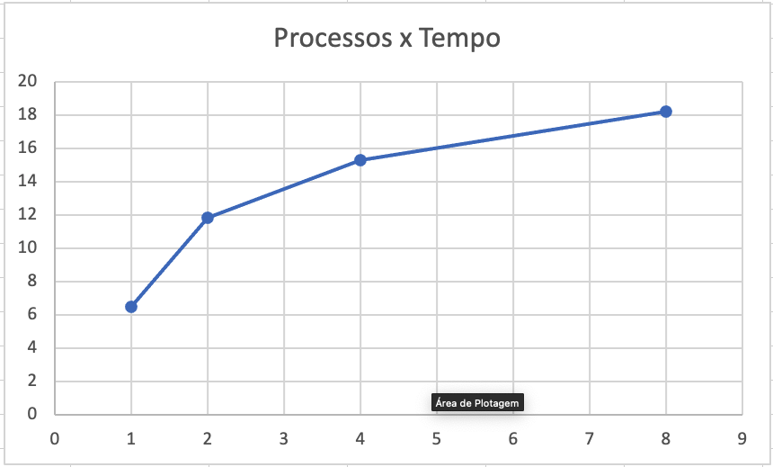
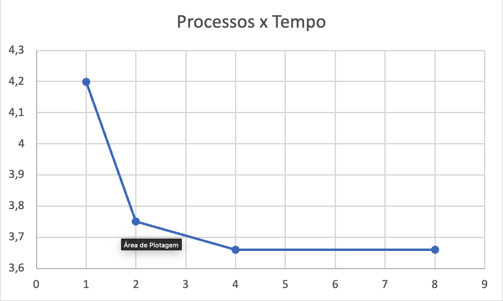

## Trabalho 1 PPD

## Para executar basta rodar python3 main.py

## Hardware usado para execução

* i5 10400
* 16 GB DDR4 2400MHZ
* SSD

## Resultado

### Algoritmo padrão do python com 50.000.000 elementos

Processos|Segundos
--- | ---
1|6,45
2|11,83
4|15,29
8|18,21

### BubbleSort com 5.000 elementos

Processos|Segundos
--- | ---
1|4,20
2|3,75
4|3,66
8|3,66

## Discursões

Para ter um ganho paralelizando as ordenações seria necessário usar um algoritmo que se beneficiara do vetor pré-ordenado e nisso eu só consigo pensar em BubbleSort, porem o BubbleSort ficaria horas rodando se eu usar os 50 milhões de registros.

